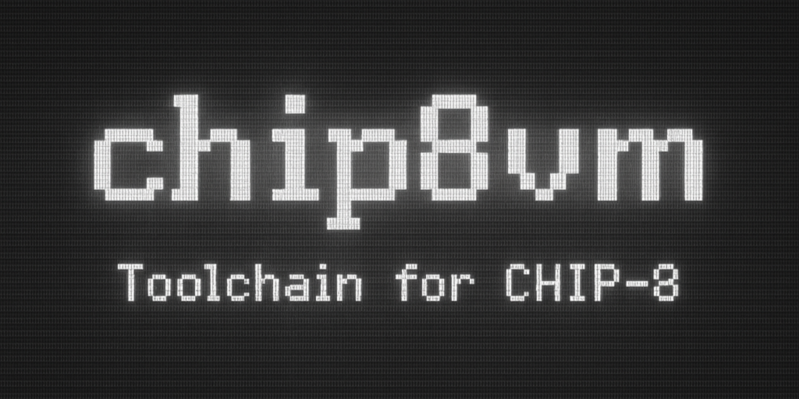

<div align="center">




</div>

# CHIP-8 Toolchain

A from-scratch implementation of a CHIP-8 toolchain, including an interpreter, assembler, and disassembler.

> CHIP-8 is a simple interpreted programming language from the 1970s, used on early 8-bit microcomputers. It's a popular starting point for emulator development due to its small instruction set and simple architecture. See the [technical reference](https://github.com/mattmikolay/chip-8/wiki/CHIP%E2%80%908-Technical-Reference) if you want to read more about it.

This project was born out of a desire to:
- Deeply understand how emulators, virtual machines & interpreters work
- Provide a comfortable toolchain for writing new CHIP-8 programs and analyze old ones
- Practice writing clean Rust code

Components:
- Interpreter:
    - Full support for the original CHIP-8 instruction set, as defined [here](https://chip8.gulrak.net/) (no "quirks"!)
    - Graphical output using SDL2
- Assembler:
    - Clear & consistent syntax (as defined by [Cowgod](http://devernay.free.fr/hacks/chip8/C8TECH10.HTM))
    - User-friendly error messages
    - Supports all instructions & useful directives
- Disassembler:
    - Translates compiled bytecode into human-readable assembly
    - Makes reverse engineering & ROM analysis easier

## TODO (maybe someday)
- [ ] Support for CHIP-8 variants ("quirks"): Super-Chip, XO-CHIP, etc.
- [ ] A GUI IDE for writing and running CHIP-8 code (like [Octo](https://internet-janitor.itch.io/octo) or [Cadmium](https://github.com/gulrak/cadmium))
- [ ] A compiled high-level language like [c8c](https://github.com/glouw/c8c)

## Building
### Requirements
- Rust (latest stable version recommended)
- SDL2 development libraries

### Steps
1. Install Rust: [https://www.rust-lang.org/](https://www.rust-lang.org/)
2. Install SDL2 development libraries:
    - Debian/Ubuntu: `sudo apt install libsdl2-dev`
    - macOS: `brew install sdl2`
    - Windows: Use [vcpkg](https://github.com/microsoft/vcpkg) or download SDL2 manually.
3. ```bash
   git clone https://www.github.com/kitrofimov/chip8vm
   cd chip8vm
   cargo build --release
   ```
4. Find the binaries in `target/release`!

## Usage
While interpreting, the CHIP-8 keypad is mapped to the keyboard as follows:
```
CHIP-8:  1 2 3 C       Keyboard:  1 2 3 4
         4 5 6 D                  Q W E R
         7 8 9 E                  A S D F
         A 0 B F                  Z X C V
```

```bash
interpreter <rom.ch8>
assembler <input.asm> <output.ch8>
disassembler <input.ch8> <output.asm>
```

## Acknowledgments
- `Timendus` for his wonderful [ROM test suite](https://github.com/Timendus/chip8-test-suite)
- `gulrak` for the [opcode table](https://chip8.gulrak.net/)
- [`mittmikolay`](https://github.com/mattmikolay/chip-8/wiki/CHIP%E2%80%908-Technical-Reference) and [`tobiasvl`](https://tobiasvl.github.io/blog/write-a-chip-8-emulator/) for their technical references
- `Cowgod` for assembler syntax [reference](http://devernay.free.fr/hacks/chip8/C8TECH10.HTM)
